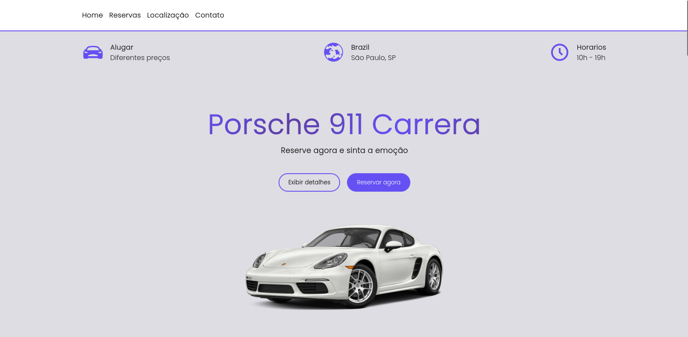

# Auto Luxury 🚗

You can access it with this [link.](https://auto-luxury-project.vercel.app/inicio)

# 💻 About the project 
The project revolves around a Luxury Car Reservation platform, offering users a seamless and user-friendly experience to explore the fleet, select desired vehicles for reservation, and finalize their bookings.

# ⏫ Some features worth highlighting

- Car Filtering: We've implemented a search functionality that allows users to filter cars by brand, year, and color. This makes it easy to find the desired car according to their preferences.
- Integration with Stripe API: To provide a secure and convenient payment method, we've integrated the Stripe API. Now, users can make payments for their chosen car directly through the platform, using reliable payment methods.
- Enhanced User Experience: Our focus has been on creating an intuitive and user-friendly interface. This ensures that users can navigate the platform effortlessly, view detailed car information, and complete their reservations without complications.

# ⏫ Some future features

- User Login and Registration System: We plan to implement a robust user login and registration system. This will allow users to create personalized accounts, access their individual control panel, and easily track their past and current reservations.
- Real-time Notifications: We intend to implement real-time notifications to keep users informed about new available cars, special offers, and important updates related to their reservations.

# 🚀 Technologies 
Auto Luxury was developed using the following technologies:

- Styled components
- React.js
- TypeScript
- Node.js
- Express.js
- Stripe
- Vercel (hosting platform)

# 🔨 Used libraries 

- React Icons
- React-leaflet
- React-router-dom
- React-stripe-checkout
- Styled components
- Yup

# ⚠️ Important warning
Currently, the front-end hosting of the website has been successfully completed and it is already accessible through the following URL: [[link.](https://auto-luxury-project.vercel.app/inicio). However, it is important to mention that the back-end has not yet been hosted. But soon the backend hosting will be available for access.

# 🛠️ How to install the project on your machine
To install and run the project, follow the steps below:

<h3>Before you begin, make sure you have the following tools installed on your system:</h3>

- Node.js (version 14 or higher)
- NPM (Node Package Manager) ou Yarn

<h3>Step 1: Clone the repository</h3> 

- Clone this repository to your local environment:

```bash
git clone https://github.com/devpdro/auto-luxury-project.git
```

<h3>Step 2: Install dependencies</h3> 

- Navigate to the project directory:

```bash
cd auto-luxury-project
```

- Install the project's dependencies:

```bash
npm install
```

<h3>Step 3: Run the project</h3> 

- Start the development server:

```bash
npm start
```

Made with ❤️ by Victor Hugo 👋